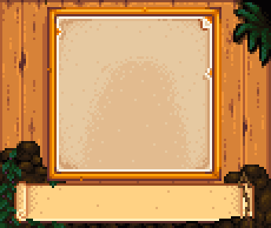

[PortraitFrameVariations](https://www.nexusmods.com/stardewvalley/mods/6899) adds variations to dialogue's portrait frame. The changes are based on season and current happenings around the valley. Mod visual style is meant to blend in with the base game style.

## Contents

* [Configuration](#configuration)
* [Portrait Frames](#portrait_frames)
  * [Seasonal](#seasonal)
  * [Festival](#festival)
  * [Map](#map)
  * [Event](#event)
* [Compatibility](#compatibility)
* [FAQ](#faq)
* [Notes](#notes)

## Configuration
> [!IMPORTANT]
> This mod requires [Generic Mod Config Menu](https://www.nexusmods.com/stardewvalley/mods/5098).
 

The mod config supports:

- Setting default portrait frame.
- Disable conditional edit. This is used for user that just want to use a single portrait frame. Default frame will be used.
- Enable or disable condition when a frame is applied.
- Setting frames that should be used in specific condition. In case more than one is specified, random frame would be chosen.

Details of each config is given when hovered over in [Generic Mod Config Menu](https://www.nexusmods.com/stardewvalley/mods/5098) menu.

## Portrait Frames

At release (1.0.0), there are 19 seasonal frames, 10 festival frames, 9 map specific frames, and 3 event specific frames. The edits is overlayed on top of existing UI, allowing minimal compatibility for UI recolor mod.

### Seasonal

<b>Spring</b> 

<b>Summer</b> 

<b>Fall</b> 

<b>Winter</b> 

### Map

<b>Ginger Island</b> 

<b>Sewer</b> 

<b>Spring Beach</b> 

<b>Summer Beach</b> 

<b>Fall Beach</b> 

<b>Winter Beach</b> 

<b>Mine Entrance</b> 

### Festival

<b>Egg Festival</b> 

<b>Flower Dance</b> 

<b>Luau</b> 

<b>Dance of the Moonlight Jellies</b> 

<b>Stardew Valley Fair</b> 

<b>Spirit's Eve</b>  

<b>Festival of Ice</b>  

<b>Night Market</b>  

<b>Feast of the Winter Star</b>  

### Event

<b>Wedding</b> 

<b>Salmonberry Season</b> 

<b>Blackberry Season</b> 

### Unused

This frame is meant to show on Sebastion and Maru events that include night time sky. However, it's not possible to specifically patch when player is in temporary on an event.

## Compatibility
- [Farmer Portraits](https://www.nexusmods.com/stardewvalley/mods/11398). If you set 'UseCustomPortrait' on that mod to true, then you can configure this mod to have farmer portrait and character portrait frame in sync.
- [Stardew Valley Expanded](https://www.nexusmods.com/stardewvalley/mods/3753). There is config to not overwrite "Galdoran Theme" which is set to true by default.

## FAQ

1. Is it safe to add this mod mid-save?  
This is a retexture mod. It should be pretty safe to add and or remove from any save.
2. Can I use this mod in multiplayer?  
Yes you can! Even if it's only you that installed this mod, it would still work (Only you would see the mod in action though)
3. Is this mod compatible with that mod?  
Most definitely compatible if other mod does not touch the portrait frame.

## Notes
- The few first assets for this mod is made as part of Winter 2023 event in Stardew Valley Discord. Go Igloo!
- The idea of this mod is inspired by Galdoran Theme in [Stardew Valley Expanded](https://www.nexusmods.com/stardewvalley/mods/3753)
