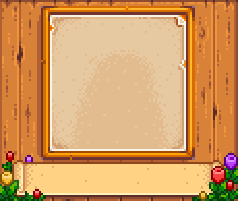
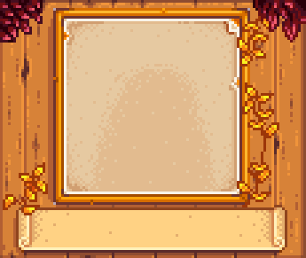
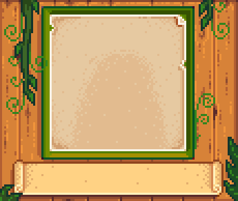
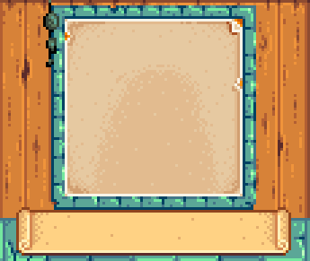
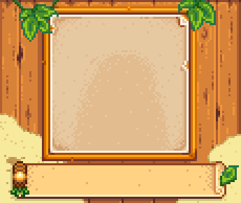
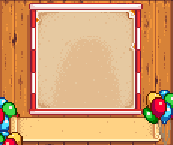

[Portrait Frame Variations](https://www.nexusmods.com/stardewvalley/mods/6899) adds selection of dialogue's portrait frame. The portrait frames are displayed based on season and current happenings around the valley. Mod visual style is meant to blend in with the base game style.

## Contents

* [Configuration](#configuration)
* [Portrait Frames](#portrait_frames)
  * [Seasonal](#seasonal)
  * [Festival](#festival)
  * [Map](#map)
  * [Event](#event)
* [Compatibility](#compatibility)
* [FAQ](#faq)
* [Notes](#notes)

## Configuration
> [!IMPORTANT]
> Requires [Generic Mod Config Menu](https://www.nexusmods.com/stardewvalley/mods/5098).

The mod config supports:

- Setting default portrait frame.
- Disable conditional edit. This is used for user that just want to use a single portrait frame. Default frame will be used.
- Enable or disable condition when a frame is applied.
- Setting frames that should be used in specific condition. In case more multiple frames specified, random one would be chosen.

Details of the config options is available when hovered over in [Generic Mod Config Menu](https://www.nexusmods.com/stardewvalley/mods/5098) menu.

### Adding or Removing Frame
You can disable or enable certain frame by editing the Option field. 

For example, let's say you want to make it so that in Spring it would always show portrait frame that by default was set to only be used during Flower Festival.
1. Locate and clear out config option. Because it's Spring we're clearing up SpringOption. 

2. Type the name of the frame you want to use. You can check [Portrait Frames](#portrait_frames) for that. In this case the default frame name used in Flower Festival is 'MerryFlowers'. 

3. Save & Close, on regular Spring day it will only show 'MerryFlowers'.

### Hide NPC Heart Level Indicator
Set 'Hide Hear Indicator' to true, indicated by having X mark

| When set to false | When set to true |
| --- | --- |
|  |  |

## Portrait Frames

At release (1.0.0), there are 21 seasonal frames, 10 festival frames, 9 map specific frames, and 1 event specific frames. The edits is overlayed on top of existing UI, allowing minimal compatibility for UI recolor mod. Below is the default portrait frames setting. You can adjust the list through the config to add or remove portraits frame.

### Seasonal

| Spring | |
| --- | --- |
|    PinkPetals |    Tulips |
|    SimpleDandelions |    Daffodils |

| Summer | |
| --- | --- |
|    SunFlowers |    VinesAndFerns |
|    Blueberries |    RowOfHops |
|    Starfruits | |

| Fall | |
| --- | --- |
|    ScatteredLeaves |    WildMushrooms |
|    FallFoliages |    Eggplants |
|    CornCobs | |

| Winter | |
| --- | --- |
|    SnowPiles |    FrostedPines |
|    Crocuses |    WinterFoliages |
|    WinterWallOrnaments | |

| Salmonberry Season |
| --- |
|    SalmonberryBush | |

| Blackberry Season |
| --- |
|    BlackberryBush | |

### Map

| Ginger Island | |
| --- | --- |
|    IslandPalms |    TropicalVines |
|    IslandHut | |

| Sewer |
| --- |
|    GoodOldSewer |

| Spring Beach |
| --- |
|    LonelyClam |

| Summer Beach |
| --- |
|    ChildhoodMemories |

| Fall Beach |
| --- |
|    SimpleFallBeach |

| Winter Beach |
| --- |
|    NautilusShell |

| Mine Entrance |
| --- |
|    LevelZero |

### Festival

| Egg Festival |
| --- |
|    FestiveEggs |

| Flower Dance |
| --- |
|    MerryFlowers |

| Luau |
| --- |
|    LeavesAndTorch |

| Dance of the Moonlight Jellies |
| --- |
|    CandlesOnSea |

| Stardew Valley Fair |
| --- |
|    FairBalloons |

| Spirit's Eve | |
| --- | --- |
|    PumpkinsAndSpiders |    Spooky |

| Festival of Ice |
| --- |
|    IceCastles |

| Night Market |
| --- |
|    ColorfulMarket |

| Feast of the Winter Star |
| --- |
|    HolidayPresents |

### Event

| Wedding |
| --- |
|    WhiteWedding |

### Unused

| Unused | |
| --- | --- |
|    StarryNight | This frame is meant to show on Sebastian and Maru events that shows night time sky. However, it's not possible to specifically patch when player is in temporary map during an event. |

## Compatibility
- [Farmer Portraits](https://www.nexusmods.com/stardewvalley/mods/11398). To use same dialogue's portrait frame for farmer and character, set 'Use Custom Background' to false in that mod.
- [Stardew Valley Expanded](https://www.nexusmods.com/stardewvalley/mods/3753). Option to not overlay "Galdoran Theme" is set to true by default.

## FAQ

1. Is it safe to add this mod mid-save?  
This is a retexture mod. It should be pretty safe to add and or remove from any save.
2. Can I use this mod in multiplayer?  
Yes you can! Even if it's only you that installed this mod, it would still work (Only you would see the mod in action though)
3. Is this mod compatible with that mod?  
Most definitely compatible if the other mod doesn't touch dialogue's portrait frame.
4. Is this mod compatible with UI Recolor like ?  
On most case, this mod will overlay (draw on top) the UI mods. This mean you can use this mod and UI Recolor mod. However, how the two visual will blend in is a different subject and should be judged by yourself.

## Notes
- The few first assets for this mod is made as part of Winter 2023 event in Stardew Valley Discord. Go Igloo!
- This mod is inspired by Galdoran Theme in [Stardew Valley Expanded](https://www.nexusmods.com/stardewvalley/mods/3753)
