[Portrait Frame Variations](https://www.nexusmods.com/stardewvalley/mods/6899) adds selection of portrait frames. They are displayed based on season and current happenings around the valley. Mod visual style is meant to blend in with the base game style.

## Contents

* [Configuration](#configuration)
* [Portrait Frames](#portrait-frames)
  * [Seasonal](#seasonal)
  * [Map](#map)
  * [Festival](#festival)
  * [Event](#event)
* [Compatibility](#compatibility)
* [FAQ](#faq)
* [Notes](#notes)

## Configuration
> [!IMPORTANT]
> [Generic Mod Config Menu](https://www.nexusmods.com/stardewvalley/mods/5098) is highly recommended.

The mod config supports:

- Setting default portrait frame that will be used when no condition match.
- Disable conditional edit. This is used for user that just want to use a single portrait frame. Default frame will be used.
- Enable or disable condition when a frame is applied.
- Setting frames that would be used in specific condition. In case more than one frame specified, random one would be chosen.

Details of the config options is shown when hovered over in [Generic Mod Config Menu](https://www.nexusmods.com/stardewvalley/mods/5098) in-game mod options.

### Adding or Removing Frame
You can disable or enable certain frame by editing the "Options" field. 

For example, let's say you want to have only Flower Festival portrait frame in regular Spring day without all the other usual portrait frame roster.
1. Locate and clear out config option. Because it's Spring we're clearing up "Spring Options". 

2. Type the name of the frame you want to use. You can check [Portrait Frames](#portrait_frames) for that. The default frame name used in Flower Festival is 'MerryFlowers'. 

3. Save & Close, on regular Spring day it will only show 'MerryFlowers'.

Keep in mind that the field requires exact name. However, don't worry too much because you can always set everything back to default if anything goes wrong. There's default button on [Generic Mod Config Menu](https://www.nexusmods.com/stardewvalley/mods/5098) or you can manually delete config.json inside the mod folder.

### Hide NPC Heart Level Indicator
Set 'Hide Heart Indicator' to true, indicated by having X marks.  

| False ( ) | True (X) |
| --- | --- |
|  |  |

## Portrait Frames

In version 1.3.0, there are 39 seasonal frames, 13 festival frames, 38 map specific frames, and 1 event specific frames. The assets are meant to be overlayed on top of existing UI, in some case this led to minimal compatibility with UI recolor mod. Presented is how portrait frames configured. 
- Edited assets made for [Changing Skies](https://www.nexusmods.com/stardewvalley/mods/19513) is available [here](Documentation/PortraitFrames_ChangingSkies.md).

### Seasonal

| Spring | |
| --- | --- |
|    PinkPetals |    Tulips |
| 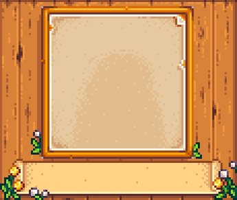   SimpleDandelions |    Daffodils |
|    SpringBlossoms |    GreenBeans |

| Summer | |
| --- | --- |
|    SunFlowers | 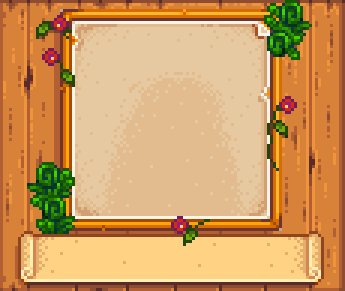   VinesAndFerns |
|    Blueberries |    RowOfHops |
|    Starfruits |    FloweryVines |
|    TowerFlower | |

| Fall | |
| --- | --- |
|    ScatteredLeaves |    WildMushrooms |
|    FallFoliages |    Eggplants |
|    Corns | 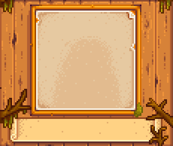   MossyTwigs |
|    MossyBranches | |

| Winter | |
| --- | --- |
|    SnowPiles | 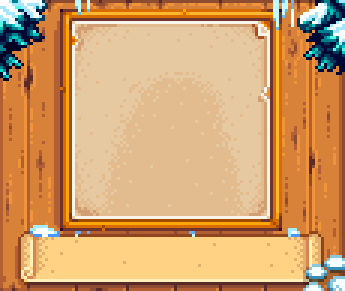   FrostedPines |
| 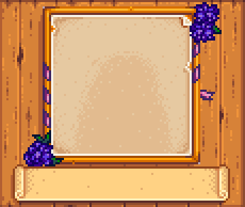   Crocuses |    WinterFoliages |
|    WinterWallOrnaments |    Snowmen |
| 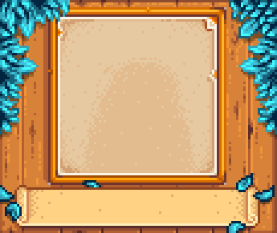   IcyLeaves |    CandyCanes |
| 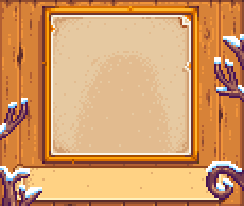   SnowyBranches |    SnowyTwigs |
|    FrozenFerns | |

| Salmonberry Season |
| --- |
|    SalmonberryBush |

| Blackberry Season |
| --- |
|    BlackberryBush |

| Green Rain | |
| --- | --- |
|    GreenTree |    TwirlyTree |
|    FreshFerns | |

### Map

| Ginger Island | |
| --- | --- |
|    IslandPalms |    TropicalVines |
|    IslandHut |    BananaTree |

| Sewer |
| --- |
|    GoodOldSewer |

| Spring Beach |
| --- | --- |
|    LonelyClam |    SeaDebris |

| Summer Beach |
| --- | --- |
|    ChildhoodMemories |    ByTheSea |

| Fall Beach |
| --- | --- |
|    SimpleFallBeach | 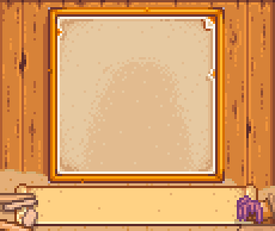   FallBeachDebris |

| Winter Beach |
| --- |
|    NautilusShell |

| Mine Entrance |
| --- |
|    LevelZero |

| Summit Day |
| --- |
| 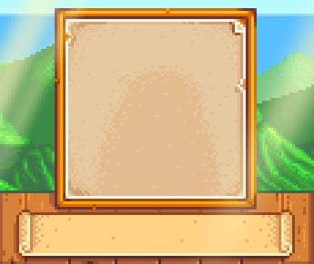   TheView |

| Summit Night |
| --- |
|    StarryNight |

| Abandoned Community Center |
| --- |
|    Abandoned |

| Refurbished Community Center |
| --- |
|    Refurbished |

| Joja Warehouse |
| --- |
|    ThatWarehouse |

| JojaMart |
| --- |
| 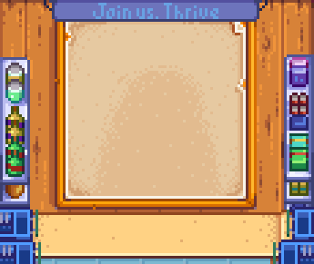   ItsJoja |

| Witch Swamp | |
| --- | --- |
| 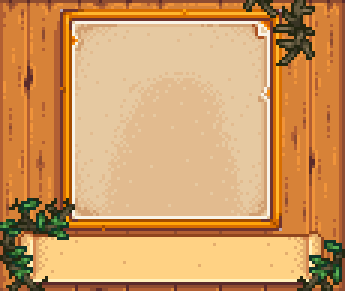   SwampBrambles |    SwampFoliages |

| Pirate Cove |
| --- |
|    YarrCave |

| Mushrooms Farm Cave |
| --- |
|    MushroomCave |

| Bats Farm Cave |
| --- |
|    BatCave |

| Bath House Entrance |
| --- |
|    BathEntrance |

| Bath House Pool |
| --- |
|    MistyBath |

| Clinic |
| --- |
| 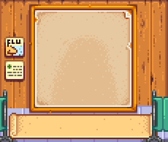   TownClinic |

| Casino |
| --- |
|    FancyCasino |

| Blacksmith |
| --- |
|    Blacksmith |

| Stardrop's Saloon |
| --- |
|    FridayNight |

| Desert |
| --- | --- |
|    CactusAndSand |    Fossils |

| Fish Shop |
| --- |
|    FishingSupplies |

| Library |
| --- |
|    Bookshelves |

| Qi Room |
| --- |
|    MysteryRoom |

| Community Center Theater |
| --- |
|    ClassicTheater |

| Joja Theater |
| --- |
|    JojaTheater |

| Theater Screening Room |
| --- |
|    TheaterRoom |

| Volcano Caldera |
| --- |
|    LavaCave |

| Volcano Dungeon |
| --- |
|    VolcanoCave |

| Bug Land |
| --- |
|    FunkyCave |

| Skull Cavern |
| --- |
|    SkullCavern |

| Adventure Guild |
| --- |
|    QuestAndAdventure |

| Linus Tent |
| --- |
|    Tent |

### Festival

| Egg Festival |
| --- | --- |
|    FestiveEggs |    EggStand |

| Flower Dance |
| --- |
|    MerryFlowers |

| Luau |
| --- |
|    LeavesAndTorch |

| Dance of the Moonlight Jellies |
| --- |
|    CandlesOnSea |

| Stardew Valley Fair |
| --- |
|    FairBalloons |

| Spirit's Eve | |
| --- | --- |
|    PumpkinsAndSpiders |    Spooky |

| Festival of Ice |
| --- |
|    IceCastles |

| Night Market |
| --- |
|    ColorfulMarket |

| Feast of the Winter Star |
| --- |
|    HolidayPresents |

| Calico Desert Festival | |
| --- | --- |
|    NiceStall |    Bazaar |

| Trout Derby |
| --- |
|    TroutFest |

| SquidFest |
| --- |
|    SquidFest |

### Event

| Wedding |
| --- |
|    WhiteWedding |

## Compatibility
- [Farmer Portraits](https://www.nexusmods.com/stardewvalley/mods/11398). To use same dialogue's portrait frame for farmer and character, set 'Use Custom Background' to false in that mod.
- [Stardew Valley Expanded](https://www.nexusmods.com/stardewvalley/mods/3753). Option to not overlay 'Galdoran Theme' is set to true by default.
- [Changing Skies](https://www.nexusmods.com/stardewvalley/mods/19513). Built-in edit will be used automatically, thanks to [Airyn](https://www.nexusmods.com/stardewvalley/users/70148453).
- UI recolor mods. On most case, this mod will overlay (draw on top) the UI mods. This mean you can use this mod and UI recolor mod. However, how the two mod visual will look is a different subject and should be judged by yourself.
Below are some portrait frames from UI recolor mods that I manually overlay. In general, UI recolor that maintain the base shape of the portrait frame fits better. I also added false dependency for those mods, in case they used 'EditImage'. If this mod doesn't appear at all when used alongside UI recolor mod, you can [add false dependency](https://stardewmodding.wiki.gg/wiki/Tutorial:_How_to_Add_a_False_Dependency_for_Load_Orders).

| UI recolor | |
| --- | --- |
|    [Overgrown Flowery Interface](https://www.nexusmods.com/stardewvalley/mods/6166) |    [Vintage Interface v2](https://www.nexusmods.com/stardewvalley/mods/4697) |
|    [DaisyNiko's Earthy Interface](https://www.nexusmods.com/stardewvalley/mods/13658) |    [Starry Sky Interface Reworked](https://www.nexusmods.com/stardewvalley/mods/15124) |
|    [Lavender Dreams UI recolor](https://www.nexusmods.com/stardewvalley/mods/17323) |    [Vanilla Accent Interface](https://www.nexusmods.com/stardewvalley/mods/16970) |

## FAQ

1. Is it safe to add this mod mid-save?  
This is a retexture mod. It should be pretty safe to add and or remove from any save.
2. Can I use this mod in multiplayer?  
Yes, you can! Even if it's only you that installed this mod, it would still work (Only you would see the mod in action though)
3. Is this mod compatible with that mod?  
Most definitely compatible if the other mod doesn't touch dialogue's portrait frame.

## Notes
- The few first assets for this mod is made as part of Winter 2023 event in Stardew Valley Discord. Go Igloo!
- This mod is inspired by Galdoran Theme in [Stardew Valley Expanded](https://www.nexusmods.com/stardewvalley/mods/3753)
